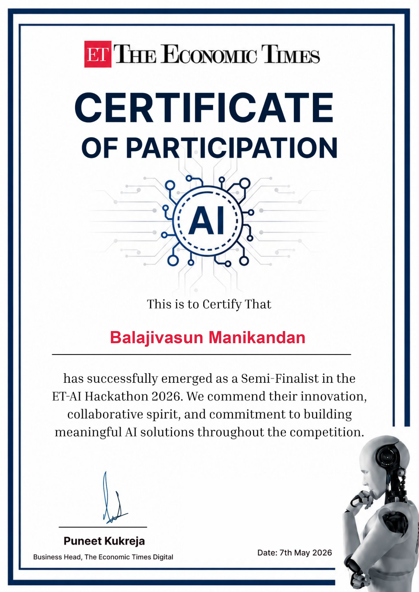

<!-- HEADER BANNER -->
<div align="center">
  
  
  <p><strong>A high-performance, agentic intelligence layer designed to migrate retail investors from reactive, tip-based trading to proactive, signal-driven decision-making.</strong></p>
  
  <p>
    <a href="#">
      
    </a>
    
    
    
  </p>
</div>

<div align="center">
  
</div>

<hr>

## ET-AI Hackathon 2026 - Semi-Finalist

We are proud to share that our team reached the Semi-Finals of the ET-AI Hackathon 2026, hosted by The Economic Times. This project was conceived and built under strict time constraints, evaluated heavily on its technical innovation and potential impact on the retail trading market.

<div align="center">
  
</div>


## The Problem We Are Solving

Retail investors often struggle in the financial markets because they rely on delayed information, emotional reactions, or generic trading tips. By the time a retail investor hears about a market movement, institutional investors have already capitalized on it. We wanted to build a system that levels the playing field by providing retail traders with the same proactive, data-driven intelligence that institutional systems use, but in an accessible and compliant format.

## Our Solution: The Agentic Swarm

ET Alpha Swarm is not just a standard trading bot. Standard bots are typically monolithic, meaning they use a single set of rigid rules to make decisions, which makes them brittle when market conditions change. 

Instead, we designed a distributed multi-agent system we call the "Coordinated Agentic Swarm". This system leverages several specialized AI personas that work together in a sequence. They cross-verify each other's work before any insight is ever presented to the user. 

### How the Swarm Operates

```text
[ Market Data Firehose ]
          │
          ▼
 1️⃣ The Sentinel (Radar) ───► Detects anomalies & price action
          │
          ▼
 2️⃣ The Analyst (Charts) ───► Validates technical breakouts
          │
          ▼
 3️⃣ The Strategist (LLM) ───► Analyzes with Portfolio Context
          │
          ▼
 4️⃣ The Guardrail (Filter) ─► Strips non-compliant advice
          │
          ▼
 5️⃣ The Messenger (UI) ─────► Delivers finalized insights
```

When the system is triggered, data flows through five distinct nodes:

1. **The Sentinel (Opportunity Radar)** 
   The Sentinel acts as the first line of observation. It constantly monitors a simulated market firehose, looking for price action anomalies and volume spikes to detect high-conviction structural signals.
   
2. **The Analyst (Chart Pattern Intelligence)** 
   Once the Sentinel detects an opportunity, it passes the data to the Analyst. The Analyst validates the initial signal against technical analysis heuristics, confirming things like breakouts or trend reversals.
 
3. **The Strategist (Market ChatGPT)** 
   With a validated technical setup, the Strategist takes over. Using ultra-fast Large Language Models, it analyzes the opportunity against the user's localized portfolio context to generate a highly personalized trading thesis.

4. **The Guardrail (Compliance Filter)** 
   Before any insight is shown to the user, it must pass through the Guardrail. This node uses strict system prompting to sanitize the output, stripping away any non-compliant financial advice and ensuring the system operates safely.

5. **The Messenger** 
   Finally, the audited insight is passed to the Messenger, which distributes the data to our interactive frontend UI for the user to review.


## System Architecture and Tech Stack

To make this swarm operate seamlessly, we split the architecture into a high-performance backend and a highly interactive frontend.

<div align="center">
  
</div>
<br>

**The Backend (Python & FastAPI)**
The core of the swarm is built in Python 3.10. We chose FastAPI because of its asynchronous capabilities, which are crucial when coordinating multiple AI agents simultaneously. Data is managed using SQLite and SQLAlchemy, while security is handled via native JWT tokens and bcrypt password hashing. 

For the AI inference engine, we integrated the Groq API running the Llama-3-8b model. Groq's specialized hardware allows us to achieve incredibly low latency, meaning the entire swarm can process complex market logic in fractions of a second.

**The Frontend (Vanilla JS & CSS3)**
We wanted the user experience to feel premium and futuristic. Instead of relying on heavy frontend frameworks, we built the interface using Vanilla JavaScript, HTML5, and CSS3. We implemented a "Cyber-Premium" aesthetic utilizing glassmorphism, responsive DOM animations, and state management powered by reactive JavaScript patterns.


## Running the Project Locally

If you would like to run the swarm on your own machine, we have made the setup process as straightforward as possible.

**Prerequisites:**
You will need Python 3.10 or higher installed. While the UI works without it, we highly recommend obtaining a Groq API Key to experience the full AI capabilities. If you do not provide a key, the backend gracefully falls back to an internal mock system so you can still interact with the UI.

**Step-by-step Setup:**
1. Clone the repository to your local machine.
2. Inside the `backend` folder, create a `.env` file and add your key like this: `GROQ_API_KEY=your_key_here`
3. Install the required Python dependencies by running `pip install -r requirements.txt`.
4. Start the application by double-clicking the `start_all.bat` file in the root directory. This script launches a unified Uvicorn server on Port 8000 that handles both the API routes and serves the frontend.
5. After a few seconds, open your browser and go to `http://localhost:8000/auth.html` to register an account and view the dashboard.


## Future Development

The hackathon was just the beginning. We plan to expand ET Alpha Swarm by integrating live WebSocket data streaming directly from the NSE, allowing users to define their own custom agent personalities, and eventually launching a mobile-responsive Progressive Web App (PWA).


## Let's Connect

<div align="center">
  
</div>

If you are interested in artificial intelligence, financial technology, or multi-agent systems, I would love to get in touch.

<div align="center">
  <a href="https://www.linkedin.com/in/balajivasun-m-2714092a5/">
    
  </a>
  <a href="https://github.com/Balajivasun/">
    
  </a>
</div>

---
<div align="center">
  <sub>Built with care during the ET-AI Hackathon 2026</sub>
</div>
